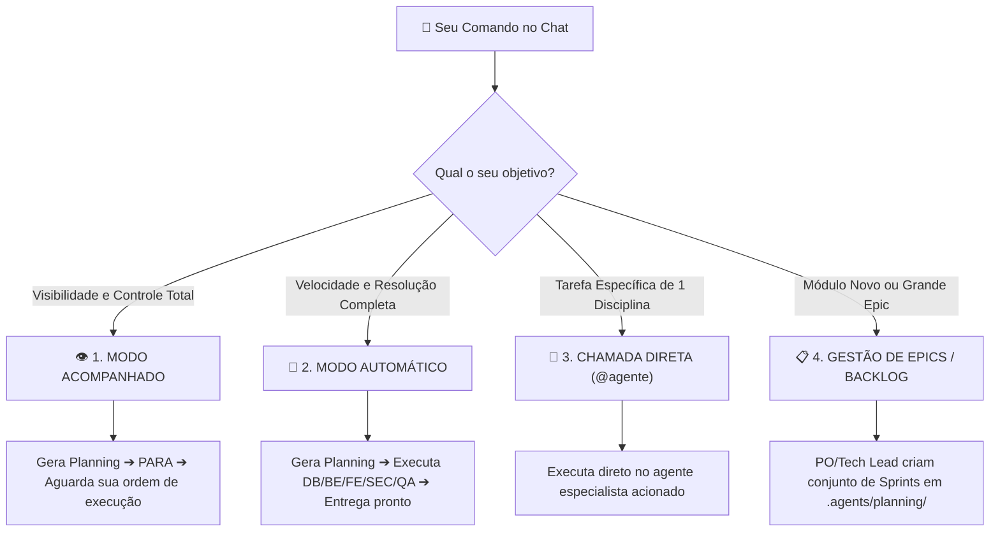

# 📖 Guia Prático de Uso da Fábrica de Software de Agentes (TUTORIAL)

Este documento é o manual oficial de uso do Squad de Agentes do **EnergySuite**. Ele descreve como acionar o `tech-lead` e os agentes especializados no seu dia a dia.

---

## 🕹️ As 4 Formas de Utilizar a Fábrica de Software

---

## 👁️ 1. Modo Acompanhado (Passo a Passo com Seu Controle)

> **Ideal para:** Quando você deseja validar o planejamento antes de alterar o código, adicionar requisitos intermediários e autorizar a execução tarefa por tarefa.

### 💬 Prompts de Exemplo:
- `"Planeje a funcionalidade de criação de usuários no modo acompanhado"`
- `"Crie a sprint para o módulo de relatórios de contratos em PDF (modo acompanhado)"`

### 🔄 Como Funciona:
1. O `tech-lead` e o `product-owner` geram o arquivo de planejamento em `.agents/planning/sprint-XX-<nome>.md`.
2. É exibida a tabela de tarefas com os **Agentes Responsáveis Atribuídos**:
   - `TASK-01 [DB]`: Modelagem PostgreSQL / Migration ➔ 🗄️ `database-engineer`
   - `TASK-02 [BE]`: CQRS MediatR + FluentValidation ➔ ⚙️ `backend-engineer`
   - `TASK-03 [FE]`: Componente Angular 18 Standalone + Signals ➔ 🎨 `frontend-engineer`
   - `TASK-04 [SEC]`: Auditoria RBAC + Tenant Isolation ➔ 🔐 `security-engineer`
   - `TASK-05 [QA]`: Testes xUnit e Jest ➔ 🧪 `qa-test-master`
3. **O sistema PARA.**
4. **Seus comandos de execução:**
   - Para rodar tudo: `"Pode implementar a Sprint XX"`
   - Para rodar aos poucos: `"Execute a Task 01"` ➔ depois `"Execute a Task 02"`
   - Para ajustar o plano: `"Altere a Task 03 para usar dialog modal antes de executar"`

---

## 🚀 2. Modo Automático (End-to-End / Ponta a Ponta)

> **Ideal para:** Funcionalidades urgentes, refatorações padrão ou hotfixes em que você quer tudo resolvido automaticamente.

### 💬 Prompts de Exemplo:
- `"Implemente a funcionalidade de recuperação de senha no modo automático"`
- `"Corrija o bug de paginação na tabela de contratos e adicione testes (automático)"`

### 🔄 Como Funciona:
1. O `tech-lead` gera o planning em `.agents/planning/`.
2. A esteira executa todas as tarefas automaticamente em sequência:
   `database-engineer` ➔ `backend-engineer` ➔ `frontend-engineer` ➔ `security-engineer` ➔ `qa-test-master` ➔ `code-reviewer` ➔ `devops-engineer`.
3. Compila o projeto (`dotnet build`, `ng build`), valida os testes (`dotnet test`, `ng test`) e te entrega o relatório final com os resultados.

---

## 🎯 3. Chamada Direta de Agentes Especializados (@agente)

> **Ideal para:** Tarefas pontuais direcionadas a um único especialista sem necessidade de criar uma esteira completa.

| Especialidade | Como acionar no chat | O que o Agente Faz |
| :--- | :--- | :--- |
| 🗄️ **Banco de Dados** | `@database-engineer Crie uma migration EF Core para a coluna Status em Contracts` | Modelagem SQL, Fluent API e EF Core Migrations |
| 🧪 **Qualidade & Testes** | `@qa-test-master Crie testes xUnit para o CreateUserCommandHandler` | Escreve e executa testes unitários/integração |
| 🔐 **Segurança** | `@security-engineer Faça um review OWASP na Controller de Auth` | Audita auth JWT, RBAC, XSS, SQLi e tenant isolation |
| 🔍 **Code Review** | `@code-reviewer Revise o código da pasta frontend/mf-portfolio` | Audita SOLID, Clean Code, ausência de `any` e débitos |
| 🎨 **Frontend Master** | `@frontend-master Converta a tela de Contratos para Angular Signals` | Arquitetura Angular 18 Standalone, Signals e UX/UI |
| ⚙️ **Backend Architect** | `@backend-architect Desenhe o Command e DTO do fluxo de Boletagem` | Arquitetura C# .NET 8, CQRS MediatR e API contracts |
| 📊 **Data & AI** | `@data-ai-engineer Otimize o cálculo do Pluvia vetorizando com NumPy` | Pipelines Python, Parquet, MLflow e modelos estatísticos |
| ☁️ **DevOps & Infra** | `@devops-engineer Atualize a pipeline do GitHub Actions para rodar testes` | CI/CD, Dockerfiles multi-stage e Helm/Kustomize |

---

## 📋 4. Gestão de Grandes Módulos e Epics (Visão de Produto)

> **Ideal para:** Grandes iniciativas de negócios, novos módulos do sistema ou refatorações de grande porte.

### 💬 Prompts de Exemplo:
- `"@tech-lead Analise o projeto e monte o plano de Sprints para implementar a Boletagem CCEE no BackOps"`
- `"@product-owner Faça um benchmarking do módulo de Comercialização e crie o backlog de Sprints"`

---

## 📁 Onde Acompanhar o Status das Sprints?

Todas as Sprints e tarefas geradas ficam salvas e visíveis no diretório **`.agents/planning/`**:
- `product-backlog.md`: Visão macro de todos os Epics do EnergySuite.
- `sprint-XX-<nome>.md`: O documento detalhado da Sprint atual com a lista de tasks e os responsáveis.
- `execution_state.json`: O arquivo de status em tempo real das tarefas (`PENDING`, `IN_PROGRESS`, `QA_VERIFIED`, `DONE`).
