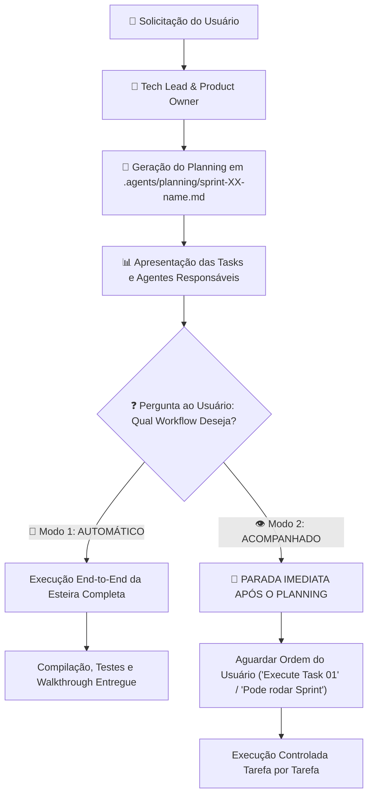

# ⚙️ EnergySuite Software Factory — Workflow & Execution Protocol

Este documento define as regras operacionais, o fluxo de comunicação entre agentes e o protocolo de execução da **Fábrica de Software de Agentes do EnergySuite**.

---

## 🎯 1. Fluxo de Operação e Seleção de Workflow

TODA requisição enviada por um usuário (seja simples ou complexa) passa **OBRIGATORIAMENTE** por 2 etapas:

---

## 👥 2. Matriz RACI do Squad de Agentes

| Papel / Agente | Responsabilidade Principal | Ferramentas Chave |
| :--- | :--- | :--- |
| **`tech-lead`** | **Accountable (A)**: Maestro, orquestrador do estado do projeto e da esteira. | `write_to_file`, `run_command`, `replace_file_content` |
| **`product-owner`** | **Responsible (R)**: Mapeamento de histórias de usuário, backlog e critérios de aceite. | `grep_search`, `write_to_file`, `read_url_content` |
| **`solution-architect`** | **Responsible (R)**: Arquitetura macro, OpenAPI, C4 e contratos inter-serviços. | `view_file`, `write_to_file` |
| **`database-engineer`** | **Responsible (R)**: Modelagem PostgreSQL, EF Core Fluent API e Migrations. | `run_command`, `replace_file_content` |
| **`backend-architect` / `backend-engineer`** | **Responsible (R)**: APIs C# .NET 8, CQRS MediatR, FluentValidation e Python. | `run_command`, `replace_file_content` |
| **`ui-designer` / `frontend-master` / `frontend-engineer`** | **Responsible (R)**: Angular 18 Standalone, Signals, Design Tokens e UX/UI. | `run_command`, `replace_file_content` |
| **`security-engineer`** | **Consulted/Informed (C/I)**: Auditoria OWASP, Auth JWT/Keycloak, RBAC e Secrets. | `grep_search`, `view_file` |
| **`qa-test-master`** | **Responsible (R)**: Execução de testes xUnit, PyTest, Jest e prevenção de regressão. | `run_command` (`dotnet test`, `ng test`) |
| **`code-reviewer`** | **Consulted/Informed (C/I)**: Auditoria de PR, SOLID, Clean Code e Débito Técnico. | `view_file`, `grep_search` |
| **`devops-engineer` / `sre-observability`** | **Responsible (R)**: CI/CD GitHub Actions, Docker, K8s, Prometheus e Loki. | `run_command`, `write_to_file` |

---

## 🛑 3. Gates de Qualidade (Gating Rules)

Uma tarefa ou Sprint **NUNCA** pode ser fechada sem atender aos 3 critérios de aceite:
1. **Compilação sem Avisos Críticos**: `dotnet build` e `ng build` devem retornar código de saída 0.
2. **100% de Testes Passando**: Todos os testes unitários e de integração existentes + novos devem passar.
3. **Revisão Aprovada**: O código deve estar em total conformidade com a Clean Architecture definida em `AGENTS.md`.

---

## 📂 4. Persistência em `.agents/planning/`

- **`product-backlog.md`**: Visão global de Epics e Módulos do sistema.
- **`sprint-XX-<nome>.md`**: Documento da Sprint contendo o plano detalhado, User Story, Tabela de Tasks e Agentes Responsáveis.
- **`execution_state.json`**: JSON de acompanhamento em tempo real do estado de cada tarefa.

---

## 📌 5. Regra Estrita de Uso de Agentes

> ⚠️ **MANDATO ESTRITO:** É OBRIGATÓRIO utilizar exclusivamente os agentes personalizados pré-existentes catalogados na pasta `.agents/agents/`. **É PROIBIDO criar ou instanciar subagentes dinamicamente.** Qualquer tarefa atribuída deve carregar diretamente as personas e diretrizes dos arquivos Markdown em `.agents/agents/`.

