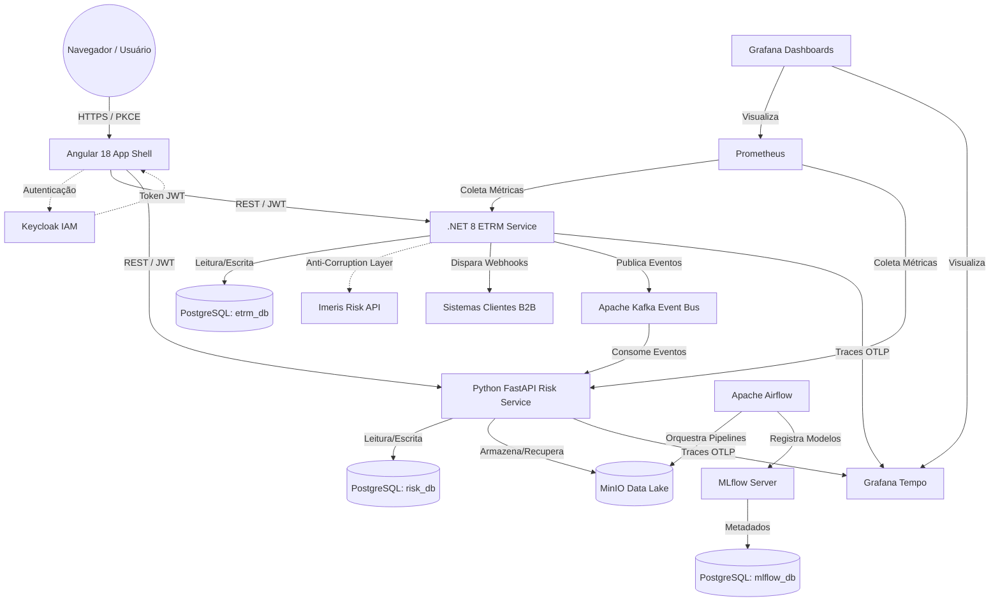

# ⚡ EnergySuite - ETRM SaaS Platform

O **EnergySuite** é uma plataforma inovadora **B2B SaaS Multi-Tenant** projetada para **Energy Trading and Risk Management (ETRM)** (Gestão de Risco e Comercialização de Energia). Construída sob uma arquitetura moderna de microsserviços, a solução oferece isolamento rigoroso de dados, análises avançadas de risco, recursos de machine learning e uma infraestrutura altamente escalável para atender às demandas complexas do setor de energia.

---

## 🚀 Principais Funcionalidades

* **Isolamento de Dados (Multi-Tenancy)**: Utiliza *Global Query Filters* do Entity Framework para garantir a separação lógica e segura dos dados entre diferentes clientes corporativos (tenants).
* **Menza (Portfolio & Trading Cockpit)**: Módulo analítico avançado para gestão de portfólio. Inclui o *Opportunity Engine* que cruza gaps com estratégias, um **AI Trading Copilot** para simulação preditiva ("Antes vs Depois") e validação automática de risco de crédito (Integração Imeris).
* **Segurança Corporativa (SSO e IAM)**: Integração com o **Keycloak** (OIDC/JWT) para gestão centralizada de identidades, controle de acesso baseado em funções (RBAC) e autenticação segura via PKCE em todos os microsserviços e frontends.
* **Governança e Webhooks B2B**: O backend possui um pipeline de auditoria interceptando todas as ações do usuário e dispara notificações (*Webhooks*) automáticas em caso de violação de limites corporativos.
* **Análise Avançada de Riscos**: Um motor de risco dedicado, construído em Python com FastAPI, responsável por processar métricas de *Mark-to-Market* (MtM) e calcular a exposição financeira.
* **Dashboards Dinâmicos de Portfólio**: Um *App Shell* desenvolvido em Angular 18 (Micro Frontend) que abriga o módulo `mf-portfolio`, consumindo dados via tabelas reativas, cards de simulação e gráficos ECharts, permitindo exportações CSV client-side.
* **Observabilidade End-to-End**: Stack completa de telemetria com Prometheus, Grafana e Grafana Tempo (OpenTelemetry) para métricas e rastreamento distribuído de requisições.
* **Pipeline de MLOps**: Ambiente abrangente de Machine Learning que inclui MinIO (Data Lake), MLflow (Registro de Modelos) e Apache Airflow (Orquestração de Workflows).

---

## 🏗️ Arquitetura e Stack Tecnológico

A plataforma é dividida em serviços desacoplados que se comunicam através de APIs REST e fluxos de eventos assíncronos via Apache Kafka.

### 🌐 Frontend
* **Angular 18 (Micro Frontend App Shell)**: Atua como o hub central para a integração de diversos MFEs. Implementa o `keycloak-angular` para proteção segura de rotas e gestão do token JWT.
* **Apache ECharts**: Motor de renderização do Dashboard de Risco, garantindo visualizações fluidas de grandes volumes de dados financeiros.

### ⚙️ Serviços de Backend (Microservices)
* **ETRM Service (.NET 8)**: O motor transacional central, responsável por gerenciar contratos de energia, clientes, tenants e as operações de trading do módulo **Menza**. Conta com pipeline rigoroso de Auditoria (MediatR Behavior) e envio de Webhooks B2B. Utiliza Entity Framework Core e PostgreSQL.
* **Risk Service (Python FastAPI)**: Motor computacional de alta performance para execução de modelos complexos de risco financeiro e simulações.
* **MLOps / Engenharia de Dados (Python)**: Utiliza **Apache Airflow** para agendamento de pipelines de dados e **MLflow** para o rastreamento e versionamento de modelos preditivos.

### 🗄️ Infraestrutura e Armazenamento
* **Bancos de Dados Relacionais**: PostgreSQL 15 (Bancos segregados: `etrm_db`, `risk_db`, `mlflow_db`, `airflow_db`).
* **Object Storage / Data Lake**: MinIO (Compatível com Amazon S3).
* **Mensageria / Event Broker**: Apache Kafka (Modo KRaft).
* **Provedor de Identidade (IdP)**: Keycloak 22.0.

---

## 📊 Diagrama de Arquitetura do Sistema



---

## 🐳 Executando o Projeto Localmente

Todo o ecossistema está conteinerizado utilizando o Docker Compose para facilitar o desenvolvimento local e garantir paridade com o ambiente de produção.

### Pré-requisitos
* Docker e Docker Compose (v2)
* Node.js (para desenvolvimento local do frontend)
* .NET 8 SDK (para desenvolvimento local do backend em C#)
* Python 3.11+ (para MLOps e Risk Service)

### Como Iniciar

Para subir toda a infraestrutura e os serviços de forma simultânea:

```bash
cd infra
docker compose up -d --build
```

### Pontos de Acesso (Portas)

| Componente | URL / Porta | Credenciais Padrão |
| :--- | :--- | :--- |
| **App Shell (Frontend)** | `http://localhost:4200` | N/A |
| **ETRM Service API** | `http://localhost:8080/swagger` | N/A |
| **Risk Service API** | `http://localhost:8000/docs` | N/A |
| **Keycloak IAM** | `http://localhost:8083` | `admin` / `admin` |
| **Kafka UI** | `http://localhost:8081` | N/A |
| **MinIO Console** | `http://localhost:9001` | `minioadmin` / `minioadmin` |
| **Grafana** | `http://localhost:3000` | `admin` / `admin` |
| **MLflow UI** | `http://localhost:5000` | N/A |
| **Apache Airflow** | `http://localhost:8082` | Padrão |

---

## 🛡️ Segurança e Isolamento de Tenants

1. **Autenticação Uniforme**: Todos os endpoints de API exigem um token JWT válido emitido pelo Keycloak.
2. **Autorização**: O Controle de Acesso Baseado em Funções (RBAC) restringe os endpoints dependendo dos cargos do usuário e claims do tenant.
3. **Segurança de Dados (Row-level)**: Os *Global Query Filters* do Entity Framework são aplicados automaticamente nas entidades do domínio, assegurando que, na camada de banco de dados, todas as consultas SQL possuam `WHERE TenantId = @id`, impossibilitando o vazamento de informações entre empresas.

---

## 📈 Observabilidade e Monitoramento

A arquitetura enfatiza fortemente a observabilidade da saúde do sistema:
* **Métricas**: Métricas da aplicação e da infraestrutura são coletadas continuamente pelo **Prometheus** e exibidas no **Grafana**.
* **Rastreamento Distribuído**: Todos os microsserviços estão instrumentados com o **OpenTelemetry**. Os *traces* são enviados para o **Grafana Tempo**, permitindo o debug de gargalos de performance e a visualização do fluxo completo da requisição, desde o Frontend até o consumo de mensagens no Kafka.
