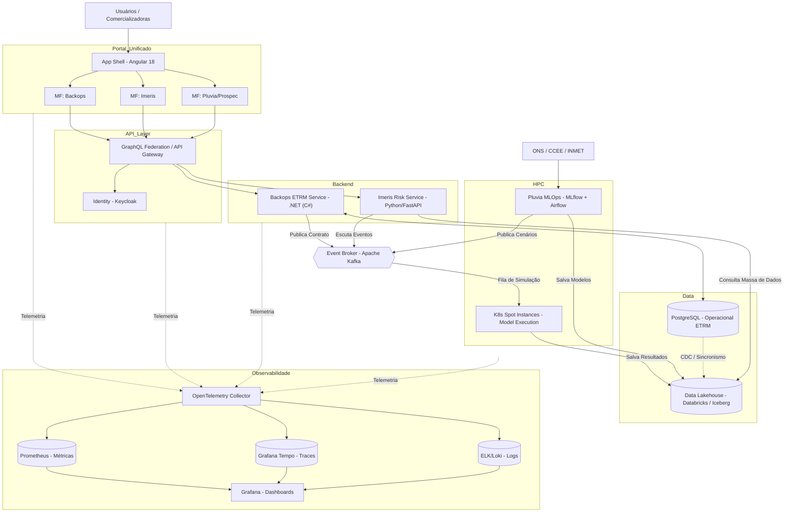

# Análise e Arquitetura Avançada para um Clone da "Suite for Energy"

Após avaliarmos a estrutura base dos produtos (Prospec, Pluvia, Imeris, Backops), evoluímos a proposta para uma **Arquitetura Cloud-Native, Orientada a Eventos e baseada em Micro-frontends**. Essa versão modernizada garante custos operacionais drasticamente menores (FinOps), integração em tempo real, alta capacidade de observabilidade e uma experiência de usuário (UX) muito superior em um portal único.

---

## 1. O Diagrama de Arquitetura Modernizada (Com Observabilidade)

---

## 2. O Que Mudou e Por Que Melhorou?

### Mudança 1: Micro-frontends unificados sob um "Shell"
* **A Melhoria:** Adotamos o padrão de **Micro-frontends**. Existe uma aplicação "Casca" (App Shell) que contém o menu lateral e o cabeçalho. Quando o usuário clica em "Risco", o código do módulo *Imeris* é carregado no centro da tela. 
* **O Porquê:** O cliente tem a experiência de um "Super App" (Portal Único). Para seus desenvolvedores, no entanto, as equipes trabalham em códigos separados, evitando que um bug na tela do *Pluvia* quebre a tela do *Backops*.

### Mudança 2: GraphQL no lugar do API Gateway tradicional
* **A Melhoria:** Introduzimos o **GraphQL Federation**.
* **O Porquê:** Um painel de energia costuma mostrar a curva de preços cruzada com a exposição financeira do contrato. Com o GraphQL, o frontend faz **um único pedido**, e o próprio GraphQL se encarrega de buscar os pedaços nos microsserviços do backend em milissegundos.

### Mudança 3: Apache Kafka como Espinha Dorsal (Orientação a Eventos)
* **A Melhoria:** O **Apache Kafka** centraliza a comunicação. Quando um trader assina um contrato no *Backops*, esse sistema apenas lança o evento: `"ContratoCriado"` no Kafka.
* **O Porquê:** O sistema de Risco (*Imeris*) escuta esse evento e atualiza automaticamente os cálculos do cliente em tempo real. Além disso, o Kafka possui a capacidade de **retenção e replay** de eventos (como um log), vital para auditorias financeiras e reprocessamento em caso de falhas.

### Mudança 4: O Fim dos Bancos Isolados -> Data Lakehouse
* **A Melhoria:** Adoção de um **Data Lakehouse** (como Databricks ou Apache Iceberg no Amazon S3).
* **O Porquê:** O Lakehouse une a organização de um banco de dados com a capacidade infinita e barata do S3. Modelos matemáticos podem ler gigabytes de séries temporais rapidamente. Permite plugar sistemas de BI (PowerBI) nativamente.

### Mudança 5: Instâncias SPOT (EKS) e MLOps para Computação
* **A Melhoria:** Usar Clusters Kubernetes (Amazon EKS) programados para usar **Instâncias Spot**. Para o *Pluvia*, incluímos o **MLOps (MLflow)**.
* **O Porquê:** As instâncias Spot custam até 80% menos. Como prever PLD demora horas, usar servidores baratos com desconto é mandatório. O MLflow foi adicionado para treinar os modelos matemáticos de chuva constantemente de forma automatizada.

### Mudança 6: Adoção do OpenTelemetry (Observabilidade Profunda)
* **A Melhoria:** Injeção de uma malha completa de observabilidade com **OpenTelemetry** capturando Logs, Métricas e Traces de ponta a ponta (Frontend, .NET, Kafka, Python).
* **O Porquê:** Em sistemas distribuídos baseados em eventos, identificar a origem de um cálculo errado ou falha é como procurar agulha no palheiro. O *Tracing Distribuído* coloca um "ID de rastreio" na requisição do usuário no Angular e segue esse ID até o modelo matemático em Python, garantindo que a equipe de engenharia resolva incidentes em minutos, não dias.

---

## 3. Stack Tecnológica Definitiva

Com base na arquitetura avançada, a stack de tecnologia escolhida foca em robustez corporativa, performance, observabilidade e facilidade de integração:

### Frontend (Portal Único / Micro-frontends)
*   **Framework Principal:** Angular 18 (utilizando Standalone Components e Webpack Module Federation para Micro-frontends).
*   **Biblioteca de UI:** Angular Material (componentes sólidos e padronizados, garantindo um design enterprise para o ETRM).
*   **Visualização de Dados:** Apache ECharts ou Highcharts (integrados ao Angular) para exibir gráficos interativos pesados (séries temporais de preços, projeções estocásticas).

### Backend (Transacional & ETRM)
*   **Linguagem principal:** .NET (C#). Padrão-ouro para sistemas corporativos e financeiros devido à tipagem forte, robustez e excelente integração em nuvem (especialmente via Entity Framework Core).
*   **Arquitetura do Código:** Clean Architecture com CQRS (via MediatR), isolando totalmente as regras de negócio das transações financeiras de energia.
*   **Banco de Dados Relacional:** PostgreSQL (para armazenar clientes, contratos, faturamento, usuários do ETRM).

### Backend (Risco & Engenharia de Dados)
*   **Linguagem principal:** Python (FastAPI, Pandas, Scikit-learn, NumPy). Utilizado especificamente onde há pesada demanda matemática e estatística (ex: Simulações de Monte Carlo do *Imeris*).
*   **Orquestração de Dados:** Apache Airflow (crucial para rodar ETLs de dados da CCEE e ONS todo dia no mesmo horário).
*   **Data Lakehouse:** Delta Lake / Apache Iceberg rodando sobre S3/Azure Data Lake, consolidando arquivos do ONS, histórico de PLD e carga do sistema em uma única fonte da verdade.

### Infraestrutura, Integração & Observabilidade
*   **Comunicação Assíncrona:** Apache Kafka (Event Broker principal para manter os microsserviços do .NET e Python sincronizados e reativos).
*   **Computação Escalável (HPC):** Kubernetes (EKS/AKS) orquestrando Jobs temporários em máquinas Spot para executar os modelos oficiais do setor (NEWAVE, DECOMP).
*   **Telemetria Padrão:** OpenTelemetry (para padronizar a emissão de dados de todos os serviços).
*   **Stack de Visibilidade:** Prometheus (Métricas de Saúde), Grafana Tempo / Jaeger (Traces Distribuídos) e Grafana Loki / ElasticSearch (Logs Centralizados). Centralizados em painéis no **Grafana**.
